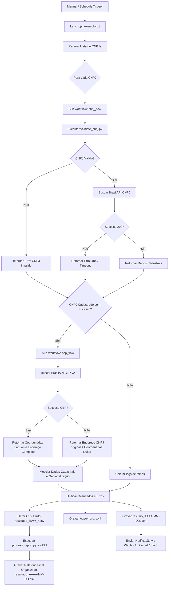

# GovData Automator

**GovData Automator** é um projeto de automação de processos robóticos (RPA) projetado para coletar, validar e consolidar informações de empresas brasileiras a partir de APIs públicas do governo. O projeto utiliza **n8n** para a orquestração e fluxo de trabalho e **Python (com Pandas)** para validação matemática de documentos e pós-processamento de relatórios.

Esta automação foi desenhada seguindo as melhores práticas de engenharia de software, segurança da informação e DevOps, sendo totalmente conteinerizada com Docker.

---

## 📊 Arquitetura do Fluxo de Dados

O diagrama abaixo ilustra como o fluxo principal (`main_flow`) gerencia a leitura dos dados, executa a validação local por meio de scripts Python, enriquece as informações com coordenadas geográficas e consolida os relatórios finais:



---

## 🛠️ Tecnologias Utilizadas

* **n8n (v1.88.0)**: Orquestrador de workflows moderno, responsável por gerenciar gatilhos, loops e integrações HTTP com retries automáticos (3 tentativas, backoff de 2s).
* **Python 3.11**: Engine de processamento local offline (validação e normalização de relatórios).
* **Pandas**: Biblioteca utilizada para o pós-processamento analítico de dados (eliminação de duplicatas e normalização textual).
* **Docker & Docker Compose**: Criação e inicialização do ecossistema isolado de RPA (n8n + volumes persistentes + container de bootstrap de workflows).

---

## 🚀 Como Executar o Projeto (Setup Passo a Passo)

### Pré-requisitos
* Ter o [Docker](https://www.docker.com/products/docker-desktop/) e o Docker Compose instalados na máquina.
* Ter uma conexão à internet ativa para consulta das APIs públicas.

### Passo 1: Preparar o arquivo de ambiente
1. Copie o arquivo `.env.example` para `.env`:
   ```bash
   cp n8n/.env.example n8n/.env
   ```
2. *(Opcional)* Se desejar notificações no Discord ou Slack, insira a URL do webhook no campo `NOTIFICATIONS_WEBHOOK_URL` dentro do arquivo `n8n/.env`.

### Passo 2: Inicializar o ambiente Docker
Suba os containers do n8n e do bootstrap de workflows:
```bash
docker compose up -d
```
> O Docker fará o download das imagens, construirá o container customizado do n8n (com Python + Pandas instalados) e subirá o container de `bootstrap`.

### Passo 3: Criar Chave de API no n8n
1. Acesse o painel do n8n em seu navegador: **[http://localhost:5678](http://localhost:5678)**.
2. Crie a sua conta de administrador local (primeiro acesso).
3. Vá em **Settings** (ícone de engrenagem no canto inferior esquerdo) -> **API** -> clique em **Create API Key**.
4. Copie a chave gerada.

### Passo 4: Configurar a Chave e Importar Workflows
1. Abra o arquivo `n8n/.env` que você criou no Passo 1 e cole a chave copiada na linha correspondente:
   ```env
   N8N_API_KEY=sua_chave_gerada_aqui
   ```
2. No seu terminal, reinicie o container de `bootstrap` para que ele importe e configure tudo automaticamente:
   ```bash
   docker compose restart bootstrap
   ```
   > **O que esse container faz?** Ele aguarda o n8n estar saudável (via endpoint `/healthz`), lê os JSONs de workflows locais, realiza o upload deles para o n8n via API REST, conecta dinamicamente os sub-workflows com os IDs corretos e ativa o fluxo principal (`main_flow`).

---

## 📖 Como Testar e Executar a Automação

1. Acesse **[http://localhost:5678](http://localhost:5678)** e recarregue a página (pressione F5 no navegador para limpar o cache).
2. Vá em **Workflows** no menu lateral. Você verá 3 fluxos criados:
   * `cnpj_flow` (Sub-workflow cadastral)
   * `cep_flow` (Sub-workflow geográfico)
   * `main_flow` (Fluxo Principal) — **Este estará ativo e agendado (Schedule Trigger).**
3. Abra o workflow `main_flow` e clique em **Execute Workflow** no painel inferior.
4. O fluxo processará os CNPJs listados no arquivo de entrada `data/input/cnpjs_exemplo.txt` e gerará os arquivos de resultados nas pastas correspondentes.

---

## 📂 Estrutura de Entrada e Saída

### Arquivo de Entrada (`data/input/cnpjs_exemplo.txt`)
Contém uma lista de CNPJs (um por linha), podendo conter pontuações (formatado) ou apenas dígitos (bruto), contendo casos válidos, inválidos e inexistentes:
```text
00000000000191
06.990.590/0001-23
11.111.111/1111-11
99.999.999/9999-99
```

### Relatório CSV Pós-processado (`data/output/resultado_AAAA-MM-DD.csv`)
Gerado após o processamento do script Pandas (`process_report.py`). Remove duplicatas por CNPJ, remove espaços em branco extras e converte todos os campos de texto para **LETRA MAIÚSCULA**:
```csv
cnpj,razao_social,situacao_cadastral,cnae_codigo,cnae_descricao,data_abertura,logradouro,numero,complemento,bairro,uf,municipio,cep,latitude,longitude,cep_status
00000000000191,BANCO DO BRASIL SA,ATIVA,6422100,BANCOS MULTIPLOS COM CARTEIRA COMERCIAL,1966-06-20,SAUN QUADRA 5 LOTE B ED SEDE I,S/N,PAVIMENTOS 1 A 16 SUL,ASA NORTE,DF,BRASILIA,70070150,-15.7869687,-47.8817757,SUCCESS
06990590000123,GOOGLE BRASIL INTERNET LTDA.,ATIVA,7312200,AGENCIAMENTO DE ESPACOS PARA PUBLICIDADE EXCETO EM VEICULOS DE COMUNICACAO,2004-12-09,AVENIDA BRIGADEIRO FARIA LIMA,3477,ANDAR 18 E 20 TORRE A,ITAIM BIBI,SP,SAO PAULO,04538133,-23.5855243,-46.6811467,SUCCESS
```

### Resumo de Execução JSON (`data/output/resumo_AAAA-MM-DD.json`)
```json
{
  "timestamp": "2026-06-13T02:22:10.123Z",
  "total_processed": 5,
  "success_count": 2,
  "error_count": 3,
  "failed_cnpjs": [
    {
      "cnpj": "11.111.111/1111-11",
      "error": "CNPJ inválido por dígito verificador"
    },
    {
      "cnpj": "06990590000100",
      "error": "CNPJ inválido por dígito verificador"
    },
    {
      "cnpj": "99.999.999/9999-99",
      "error": "Empresa não encontrada ou falha de conexão (404/Timeout)"
    }
  ]
}
```

### Histórico de Erros (`logs/errors.jsonl`)
Um log estruturado em JSON Lines contendo as falhas individuais de registros para auditorias de RPA:
```json
{"timestamp":"2026-06-13T02:22:10.123Z","cnpj":"11.111.111/1111-11","status":"error","error_message":"CNPJ inválido por dígito verificador"}
{"timestamp":"2026-06-13T02:22:10.123Z","cnpj":"06990590000100","status":"error","error_message":"CNPJ inválido por dígito verificador"}
{"timestamp":"2026-06-13T02:22:10.123Z","cnpj":"99.999.999/9999-99","status":"error","error_message":"Empresa não encontrada ou falha de conexão (404/Timeout)"}
```

---

## 🛡️ Decisões Técnicas e de Segurança

1. **Gestão de Segredos e Credenciais**: Nenhuma chave de API ou URL de Webhook foi exposta no código ou no Docker Compose. Toda a configuração é extraída de variáveis de ambiente gerenciadas localmente através do arquivo `n8n/.env`, que está devidamente ignorado no `.gitignore`.
2. **Ciclo de Vida de Onboarding (Bootstrap)**: Em vez de exigir que o usuário importe os arquivos JSON manualmente através da interface visual do n8n e configure os IDs dos sub-workflows manualmente (o que gerava erros de UUID no n8n 1.x), criamos o container `bootstrap` rodando uma imagem Python ultra-leve que realiza toda essa transação via API REST de forma robusta e limpa.
3. **Resiliência a Falhas de Banco (SQLite Exclusive Lock)**: Removido o suporte a escrita direta no arquivo SQLite do n8n. Como o n8n mantém lock exclusivo no banco de dados enquanto está ativo, modificações externas poderiam corromper dados. Toda a integração com o n8n é feita através da API REST nativa.
4. **Tolerância a Falhas Individuais**: A automação foi desenhada para que a falha em um registro (CNPJ inválido ou empresa não cadastrada) nunca interrompa a execução da fila inteira. Os registros com falhas são catalogados e reportados no resumo e nos logs locais, mantendo o processo principal funcionando até o fim.
