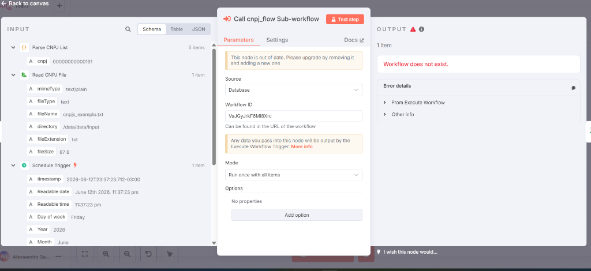
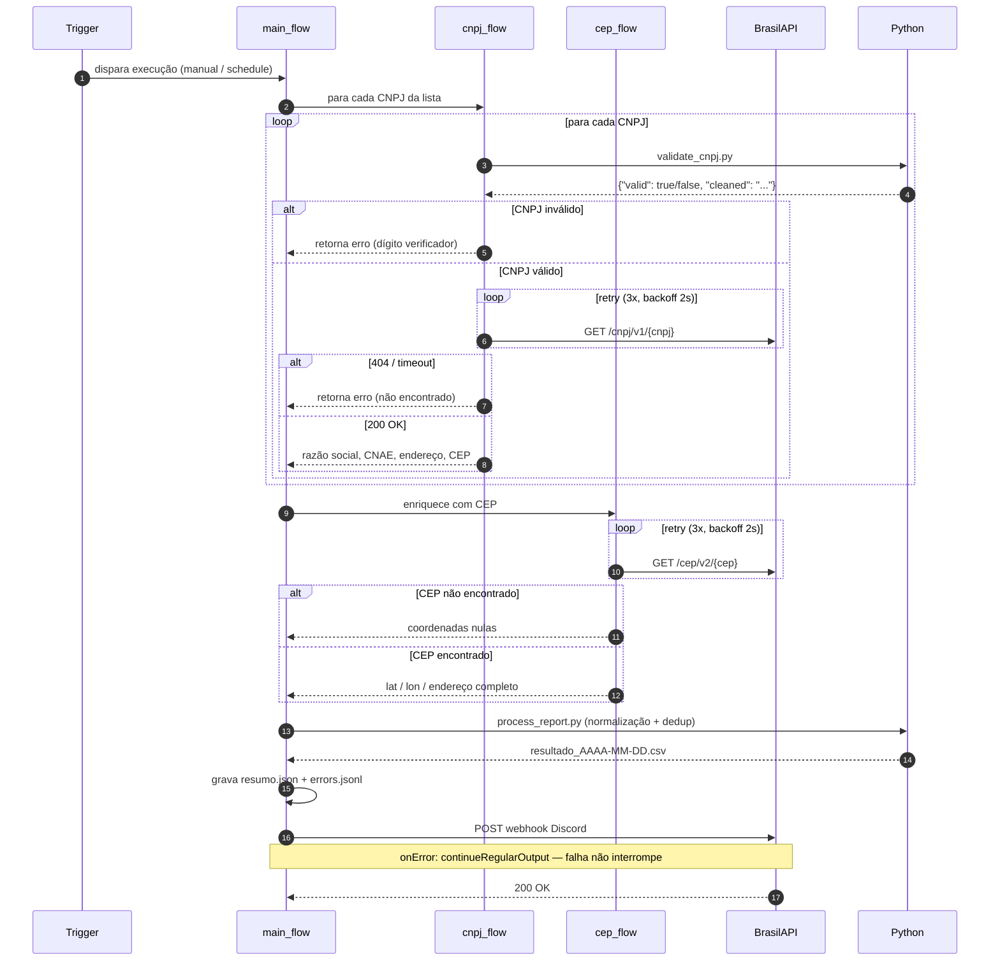

# GovData Automator


Sistema de automação de processos (RPA) para coleta, validação e consolidação de dados públicos de empresas brasileiras via APIs governamentais. Desenvolvido com **n8n** para orquestração de fluxos e **Python + Pandas** para validação matemática e pós-processamento de relatórios. Totalmente conteinerizado com Docker.

---

## Índice

- [Visão geral](#visão-geral)
- [Tecnologias](#tecnologias)
- [Arquitetura](#arquitetura)
- [Pré-requisitos](#pré-requisitos)
- [Instalação e execução](#instalação-e-execução)
- [Como testar](#como-testar)
- [Estrutura de entrada e saída](#estrutura-de-entrada-e-saída)
- [Estrutura de pastas](#estrutura-de-pastas)
- [Decisões de arquitetura](#decisões-de-arquitetura)
- [Segurança](#segurança)

---

## Visão geral

O GovData Automator processa uma lista de CNPJs em lote e retorna dados cadastrais completos, enriquecidos com geolocalização via CEP. 



Para cada CNPJ na fila, o sistema:

1. Valida o dígito verificador matematicamente (sem dependências externas)
2. Consulta a [BrasilAPI](https://brasilapi.com.br) para dados cadastrais
3. Enriquece o registro com coordenadas geográficas via CEP
4. Consolida os resultados em CSV organizado e JSON de resumo
5. Registra falhas em log estruturado (JSONL)
6. Envia notificação ao Discord/Slack ao final de cada execução

CNPJs inválidos ou empresas não encontradas são capturados como erros e reportados no resumo — **a fila nunca para por causa de um registro inválido**.

---

## Tecnologias

| Tecnologia | Versão | Papel no projeto |
|---|---|---|
| [n8n](https://n8n.io) | 1.88.0 | Orquestrador de workflows — gatilhos, loops, HTTP com retry |
| [Python](https://python.org) | 3.11 | Validação matemática de CNPJ e pós-processamento via Pandas |
| [Pandas](https://pandas.pydata.org) | 2.x | Normalização textual, deduplicação e formatação do CSV final |
| [Docker Compose](https://docs.docker.com/compose/) | v2 | Orquestração dos containers (n8n + bootstrap) |
| [BrasilAPI](https://brasilapi.com.br/docs) | v1/v2 | Dados cadastrais de CNPJ e geolocalização por CEP |

---

## Topologia da solução

O projeto é composto por três workflows n8n interligados e dois scripts Python auxiliares. O diagrama abaixo detalha a interação completa entre os componentes, incluindo os caminhos de erro, retentativas e saídas geradas.



---

## Pré-requisitos

Antes de começar, certifique-se de ter instalado:

- [Docker Desktop](https://www.docker.com/products/docker-desktop/) (inclui Docker Compose v2)
- Git
- Conexão com a internet (para consultas à BrasilAPI)

> Não é necessário instalar Python, n8n ou qualquer outra dependência localmente. Tudo roda dentro dos containers Docker.

---

## Instalação e execução

### Passo 1 — Clone o repositório

```bash
git clone https://github.com/alessandrogama/govdata-automator.git
cd govdata-automator
```

### Passo 2 — Configure o arquivo de ambiente

Copie o arquivo de exemplo:

```bash
# Linux / macOS
cp n8n/.env.example n8n/.env

# Windows (PowerShell)
Copy-Item n8n/.env.example n8n/.env
```

Abra o arquivo `n8n/.env`. Ele estará assim:

```dotenv
N8N_API_KEY=
N8N_HOST=n8n
N8N_PORT=5678
NOTIFICATIONS_WEBHOOK_URL=
```

> Deixe `N8N_API_KEY` em branco por enquanto. Você vai preenchê-la no Passo 4.
> `NOTIFICATIONS_WEBHOOK_URL` é opcional — preencha apenas se quiser notificações no Discord.

### Passo 3 — Suba os containers

```bash
docker compose up -d
```

Este comando vai:
- Baixar as imagens Docker necessárias (pode demorar alguns minutos na primeira vez)
- Construir o container customizado do n8n com Python e Pandas instalados
- Subir o n8n em `http://localhost:5678`
- Subir o container `bootstrap` em standby (aguardando a API Key)

Aguarde até o n8n estar disponível. Você pode acompanhar com:

```bash
docker compose logs -f n8n
```

Quando aparecer `Editor is now accessible via: http://localhost:5678/`, o n8n está pronto.

### Passo 4 — Crie sua conta e gere a API Key

1. Acesse **http://localhost:5678** no navegador
2. Crie sua conta de administrador local (nome, e-mail e senha — ficam apenas na sua máquina)
3. Vá em **Settings** (ícone de engrenagem no canto inferior esquerdo)
4. Clique em **API** no menu lateral
5. Clique em **Create API Key**, dê um nome (ex: `bootstrap`) e copie a chave gerada

### Passo 5 — Configure a API Key e importe os workflows

Cole a chave no arquivo `n8n/.env`:

```dotenv
N8N_API_KEY=sua_chave_gerada_aqui
```

Em seguida, reinicie o container de bootstrap:

```bash
# Linux / macOS
docker compose restart bootstrap

# Windows (PowerShell)
docker compose restart bootstrap
```

O bootstrap vai automaticamente:
- Aguardar o n8n estar saudável
- Importar os três workflows (`cnpj_flow`, `cep_flow`, `main_flow`)
- Conectar os sub-workflows com os IDs corretos
- Ativar o `main_flow`

Acompanhe o processo com:

```bash
docker compose logs bootstrap
```

Quando aparecer `Bootstrap concluído com sucesso!`, tudo está pronto.

---

## Como testar

1. Acesse **http://localhost:5678** e recarregue a página (F5)
2. No menu lateral, clique em **Workflows**
3. Você verá três workflows criados:
   - `cnpj_flow` — sub-workflow de validação cadastral (inativo por design)
   - `cep_flow` — sub-workflow de geolocalização (inativo por design)
   - `main_flow` — fluxo principal (ativo)
4. Abra o `main_flow` e clique em **Execute Workflow** no painel inferior
5. O fluxo processará os CNPJs do arquivo `data/input/cnpjs_exemplo.txt`

Os arquivos de saída são gerados em `data/output/` e os logs de erro em `logs/`.

> **Sobre os sub-workflows inativos:** `cnpj_flow` e `cep_flow` usam o nó `Execute Workflow Trigger`, que responde apenas quando chamado pelo `main_flow`. Eles não precisam estar ativos para funcionar — esse é o comportamento correto do n8n para sub-workflows.

---

## Estrutura de entrada e saída

### Entrada — `data/input/cnpjs_exemplo.txt`

Um CNPJ por linha. Aceita tanto formato com pontuação quanto apenas dígitos:

```
00000000000191
06.990.590/0001-23
11.111.111/1111-11
99.999.999/9999-99
39.198.077/0001-53
```

### Saída — `data/output/resultado_AAAA-MM-DD.csv`

CSV pós-processado pelo Pandas: sem duplicatas, campos normalizados em maiúsculas, datas formatadas.

```csv
cnpj,razao_social,situacao_cadastral,cnae_codigo,cnae_descricao,data_abertura,logradouro,numero,bairro,uf,municipio,cep,latitude,longitude,cep_status
00000000000191,BANCO DO BRASIL SA,ATIVA,6422100,BANCOS MULTIPLOS COM CARTEIRA COMERCIAL,1966-06-20,SAUN QUADRA 5 LOTE B,S/N,ASA NORTE,DF,BRASILIA,70070150,-15.7869687,-47.8817757,SUCCESS
```

### Resumo — `data/output/resumo_AAAA-MM-DD.json`

```json
{
  "timestamp": "2026-06-13T02:22:10.123Z",
  "total_processed": 5,
  "success_count": 2,
  "error_count": 3,
  "failed_cnpjs": [
    { "cnpj": "11.111.111/1111-11", "error": "CNPJ inválido por dígito verificador" },
    { "cnpj": "99.999.999/9999-99", "error": "Empresa não encontrada ou falha de conexão (404/Timeout)" }
  ]
}
```

### Log de erros — `logs/errors.jsonl`

Um registro JSON por linha, compatível com qualquer ferramenta de análise de logs:

```json
{"timestamp":"2026-06-13T02:22:10.123Z","cnpj":"11.111.111/1111-11","status":"error","error_message":"CNPJ inválido por dígito verificador"}
{"timestamp":"2026-06-13T02:22:10.123Z","cnpj":"99.999.999/9999-99","status":"error","error_message":"Empresa não encontrada ou falha de conexão (404/Timeout)"}
```

---

## Estrutura de pastas

```
govdata-automator/
├── Dockerfile                  # n8n customizado com Python + Pandas
├── docker-compose.yml          # Orquestração: n8n + bootstrap
├── .gitignore
├── n8n/
│   ├── .env.example            # Template de variáveis de ambiente
│   └── workflows/
│       ├── main_flow.json      # Fluxo principal (orquestrador)
│       ├── cnpj_flow.json      # Sub-workflow: validação e busca de CNPJ
│       └── cep_flow.json       # Sub-workflow: enriquecimento por CEP
├── python/
│   ├── validate_cnpj.py        # Validação matemática de CNPJ (sem libs externas)
│   ├── process_report.py       # Pós-processamento do CSV com Pandas
│   └── bootstrap_workflows.py  # Importação automática dos workflows via API REST
├── data/
│   ├── input/
│   │   └── cnpjs_exemplo.txt   # Arquivo de entrada com CNPJs de teste
│   └── output/                 # Relatórios gerados (ignorado pelo git)
└── logs/
    └── errors.jsonl            # Log estruturado de erros (ignorado pelo git)
```

---

## Decisões de arquitetura

### n8n como orquestrador visual

O n8n foi escolhido como orquestrador por três razões práticas: é open-source e self-hostable via Docker (sem licença), exporta workflows em JSON versionável no Git, e permite que qualquer pessoa audite a lógica do fluxo visualmente sem precisar ler código. Ferramentas como UiPath e Power Automate exigem licenças pagas e ambientes proprietários — inviáveis para um projeto público e reproduzível.

### Python delegado para lógica especializada

O n8n tem nós nativos para HTTP, transformações e condicionais, mas não é adequado para validação matemática de documentos ou processamento analítico de dados. A separação de responsabilidades foi deliberada: n8n cuida da orquestração e integração, Python cuida da lógica de domínio. Esse padrão — orquestrador visual + script especializado — reflete como automações reais funcionam em produção.

### Validação de CNPJ sem bibliotecas externas

O `validate_cnpj.py` implementa o algoritmo de dígito verificador do CNPJ usando apenas a stdlib do Python. Isso demonstra domínio do algoritmo e elimina dependências desnecessárias. A validação roda localmente antes de qualquer chamada de rede, evitando requisições para CNPJs obviamente inválidos.

### BrasilAPI em vez de scraping

Scraping de portais governamentais (Receita Federal, Correios) é frágil por natureza: qualquer atualização de layout quebra o robô. A BrasilAPI oferece endpoints REST estáveis e versionados que agregam dados de CNPJ, CEP, CNAE e outros sem necessidade de autenticação. A escolha prioriza estabilidade e manutenibilidade sobre controle total.

### Retry com backoff nos nós HTTP

Todas as chamadas à BrasilAPI têm retry automático configurado no n8n: 3 tentativas com intervalo de 2 segundos. Isso cobre instabilidades momentâneas de rede e rate limiting sem complexidade adicional no código. Falhas persistentes após as 3 tentativas são capturadas pelo fluxo de erro e registradas no log, sem interromper o processamento dos demais registros.

### Bootstrap via API REST (sem SQLite direto)

O container `bootstrap` importa os workflows via API REST do n8n em vez de escrever diretamente no banco SQLite. Escrever no SQLite enquanto o n8n está ativo causa lock de banco e pode corromper dados. A API REST é o canal oficial e seguro para essa operação, mesmo que exija uma etapa manual de geração de API Key na primeira execução.

### Sub-workflows inativos por design

`cnpj_flow` e `cep_flow` usam o nó `Execute Workflow Trigger`, que é ativado programaticamente pelo `main_flow`. Eles não precisam de trigger próprio (Schedule, Webhook etc.) e portanto permanecem inativos. Manter os sub-workflows inativos é o comportamento correto do n8n — ativá-los causaria o erro "no trigger node found".

### Tolerância a falhas por registro

O fluxo nunca quebra por causa de um único CNPJ inválido ou empresa não encontrada. Cada registro percorre seu próprio caminho de erro, é catalogado no `errors.jsonl` e incluído no resumo JSON. O `main_flow` continua processando os demais registros da fila independentemente.

---

## Segurança

- Nenhuma credencial ou URL de webhook está no código ou no `docker-compose.yml`
- O arquivo `n8n/.env` com valores reais está no `.gitignore` — apenas o `.env.example` é versionado
- Os arquivos de saída (`data/output/`) e logs (`logs/`) também estão no `.gitignore` (conformidade com LGPD — os relatórios podem conter dados de pessoas jurídicas)
- O container n8n roda com o usuário `node` (não root) após a instalação das dependências
- O log de erros (`errors.jsonl`) registra apenas metadados estruturais (CNPJ, status, mensagem de erro) — nenhum payload interno da API é armazenado

---
